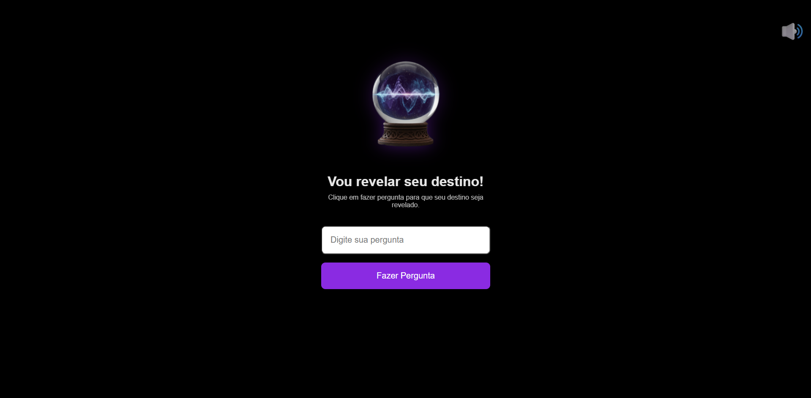

# 🔮 Destiny Revealer | Bola de Cristal Mística

Uma aplicação interativa desenvolvida com **HTML, CSS e JavaScript puro**, onde o usuário faz uma pergunta e a bola de cristal revela seu destino com uma resposta aleatória e animada.  
A experiência é complementada com **efeitos visuais e sonoros imersivos**, criando um clima mágico e divertido.

An interactive web app built with **HTML, CSS, and vanilla JavaScript**, where users can ask any question and get a mystical answer from a crystal ball — enhanced with sound and visual effects for an immersive experience.

---

## 🌐 Live Demo | Demonstração ao vivo
👉 [Acesse o projeto aqui](https://seuusuario.github.io/destiny-revealer)

---

## 📸 Preview


---

## 🧠 Funcionalidades | Features
- 🎱 Gera respostas aleatórias ao estilo “bola mágica”
- 💫 Efeito de **digitação animada** na resposta
- ✨ Bola de cristal com **brilho e animação de flutuar**
- 🎵 **Som ambiente místico** ao carregar a página
- 🔇 Botão minimalista para ativar/desativar a música
- 💻 Totalmente responsivo e feito com HTML, CSS e JS puros

---

## 🧩 Estrutura do Projeto | Project Structure

├── index.html<br>
├── index.css<br>
├── index.js<br>
└── assets/<br>
├── cristal-ball.png
├── magic.mp3
├── mystic-wind.mp3
└── preview.png

---

## 🚀 Como executar o projeto | How to run locally
1. Clone este repositório  
   ```bash
   git clone https://github.com/seuusuario/destiny-revealer.git


Abra o arquivo index.html diretamente no navegador
ou use uma extensão como Live Server (VS Code).

## 📚 Aprendizados | Learnings

Durante o desenvolvimento, pratiquei:

Manipulação de DOM com JavaScript puro

Criação de animações com CSS e keyframes

Uso de sons e controle de áudio no navegador

Práticas de design minimalista e experiência do usuário

Organização de pastas e boas práticas de código

While developing, I worked with:

DOM manipulation using vanilla JS

CSS keyframe animations

Web audio control with the <audio> API

Minimalist design & UX enhancements

Clean code and folder structure organization

## 🧑‍💻 Desenvolvido por | Developed by

Camilo Dalcim Franzini
📍 Espírito Santo, Brasil
📧 [adicione seu e-mail aqui se quiser]

## 🪪 Licença | License

Projeto licenciado sob MIT License — sinta-se livre para usar e modificar.
This project is licensed under the MIT License — feel free to use and modify.